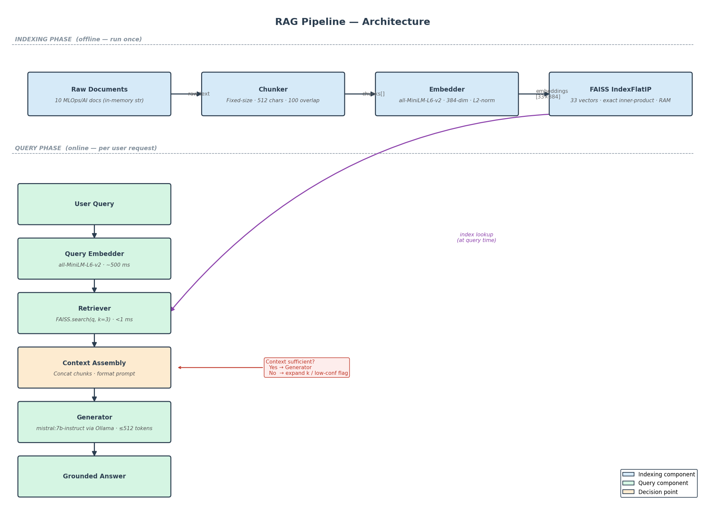

# IDS 568 — Milestone 6: RAG & Agentic Pipeline

MLOps Course | Module 7

---

## Architecture Overview



*Full annotated diagram — see [`rag_pipeline_diagram.md`](rag_pipeline_diagram.md) for ASCII version and component details.*

```
Part 1 — RAG Pipeline                Part 2 — Multi-Tool Agent
─────────────────────────────────    ──────────────────────────────────
Documents → Chunker → Embedder       Task → LLM Planner → Tool Plan
         → FAISS Index               → [Retriever | Summarizer | Extractor]
         → Retriever                 → Final Answer Generator
         → LLM Generator             → Trace saved to agent_traces/
         → Grounded Answer
```

Both components share the same FAISS index and embedding model. The agent's retriever tool reuses the RAG Part 1 retriever directly.

---

## Repository Structure

```
ids568-milestone6-kiran/
├── rag_pipeline.ipynb          # Part 1: RAG implementation (Jupyter notebook)
├── agent_controller.py         # Part 2: Multi-tool agent (Python script)
├── rag_evaluation_report.md    # Part 1: Evaluation report with real metrics
├── rag_pipeline_diagram.md     # Part 1: Pipeline architecture diagram
├── agent_report.md             # Part 2: Agent analysis report with real traces
├── eval_results_real.json      # Part 1: Raw evaluation results (10 queries)
├── agent_traces/               # Part 2: 10 task traces (JSON)
│   ├── task_01.json
│   ├── task_02.json
│   └── ... (task_03 through task_10)
├── requirements.txt            # Pinned dependencies
└── README.md                   # This file
```

---

## Model Information

| Parameter | Value |
|-----------|-------|
| **Model name** | mistral:7b-instruct |
| **Size class** | 7B parameters |
| **Quantisation** | 4-bit (Q4_0, via Ollama) |
| **Serving stack** | Ollama 0.20.7 |
| **Embedding model** | sentence-transformers/all-MiniLM-L6-v2 |
| **Hardware (evaluation)** | Apple M2 Pro, 16 GB RAM |
| **Typical generation latency** | 5–36 s per response (~15 tokens/s on M2) |

---

## Setup Instructions

### Step 1 — Prerequisites

**Install Ollama** (required for LLM inference):
```bash
# macOS
brew install ollama

# Linux
curl -fsSL https://ollama.ai/install.sh | sh
```

**Pull the required model:**
```bash
ollama pull mistral:7b-instruct
```

Verify Ollama is running:
```bash
ollama list        # should show mistral:7b-instruct
ollama run mistral:7b-instruct "Hello"   # quick sanity check
```

### Step 2 — Python Environment

```bash
# Create virtual environment (Python 3.9+)
python3 -m venv venv
source venv/bin/activate          # macOS / Linux
# venv\Scripts\activate.bat       # Windows

# Install dependencies
pip install -r requirements.txt
```

Verify key packages:
```bash
python -c "import faiss; print('FAISS OK')"
python -c "from sentence_transformers import SentenceTransformer; print('ST OK')"
python -c "import ollama; print('Ollama client OK')"
```

### Step 3 — Start Ollama Server

```bash
# In a separate terminal (or run as background service)
ollama serve

# Confirm the server is reachable
curl http://localhost:11434/api/tags
```

---

## Usage Examples

### Part 1 — RAG Pipeline (Notebook)

```bash
# Launch Jupyter
jupyter notebook rag_pipeline.ipynb
```

Run cells in order:
1. **Environment Setup** — installs/verifies packages
2. **Document Corpus** — loads 10 MLOps domain documents
3. **Chunking** — splits documents (512 chars, 100 overlap)
4. **Embedding + FAISS** — builds vector index
5. **Retrieval** — demonstrates top-k search
6. **LLM Integration** — tests Ollama connection
7. **Full RAG Pipeline** — end-to-end query execution
8. **Evaluation** — runs 10 queries, computes P@3, R@3, latency

To run a single query after building the index:
```python
result = rag_pipeline("What is RAG and how does it reduce hallucinations?")
print(result["answer"])
print(f"Retrieval: {result['latencies']['retrieval_ms']:.1f} ms")
print(f"Generation: {result['latencies']['generation_ms']/1000:.1f} s")
```

### Part 2 — Agent Controller (Script)

Run all 10 evaluation tasks and save traces:
```bash
python agent_controller.py
```

Run with a specific model:
```bash
python agent_controller.py --model mistral:7b-instruct
```

Run a single task by ID:
```bash
python agent_controller.py --task-id task_01
```

Import and use programmatically:
```python
from agent_controller import AgentController, build_rag_components, EVAL_TASKS

retriever, summarizer, extractor = build_rag_components()
agent = AgentController(retriever, summarizer, extractor,
                        model_name="mistral:7b-instruct", verbose=True)

trace = agent.run_task(
    task="Explain the benefits of LoRA for fine-tuning LLMs.",
    task_id="custom_01"
)
print(trace["final_answer"])
```

---

## Key Results

### Part 1 — RAG Pipeline

| Metric | Value |
|--------|-------|
| Hit Rate@3 (doc-level) | **0.80** — 8/10 queries retrieved ground-truth doc in top-3 (Q2 and Q9 failed) |
| Hit Rate@1 (doc-level) | **0.70** — 7/10 queries ranked ground-truth doc first |
| Precision@3 (chunk-level avg) | **0.500** |
| Recall@3 (doc-level avg) | **0.800** |
| Mean retrieval latency | **2,287 ms** (CPU embedding dominates; FAISS search < 1 ms) |
| Mean generation latency | **23.1 s** |
| Mean end-to-end latency | **25.4 s** |

### Part 2 — Multi-Tool Agent

| Metric | Value |
|--------|-------|
| Task success rate | **10/10** |
| Tool plan (all tasks) | Retriever → Extractor → Final Answer Generator |
| Typical task time | 46–113 s |
| Outlier (task_10) | 609 s — chain-of-thought generation was ~8,500 tokens |

---

## Known Limitations

1. **Ollama required at runtime** — the LLM server must be running locally. The system does not fall back to a smaller model if Ollama is unavailable.

2. **CPU inference is slow** — on CPU-only machines, generation takes 30–120 s per response. Apple Silicon (M-series) with Metal acceleration is recommended (5–36 s). For fast inference, use a GPU with vLLM.

3. **In-memory FAISS index** — the vector index is rebuilt every time the script or notebook runs. Persistence via `faiss.write_index()` is implemented in the notebook but optional.

4. **Corpus scope is limited** — the knowledge base contains 10 MLOps/AI documents (~3,600 words total). Queries outside this domain will result in low-confidence retrieval and potentially hallucinated answers.

5. **LLM planner may return unknown tool names** — task_09's planner returned a `"none"` tool. The controller skips unknown tools gracefully, but adding a JSON schema validator would make this more robust.

6. **No authentication or access control** — the system is designed for local/research use only, not production deployment.

---

## Exact Model Startup Commands

```bash
# 1. Start Ollama service (if not running as a daemon)
ollama serve &

# 2. Pull the model (first time only, ~4 GB download)
ollama pull mistral:7b-instruct

# 3. Verify the model is ready
ollama run mistral:7b-instruct "Say hello in one sentence."

# 4. Run the RAG notebook
jupyter notebook rag_pipeline.ipynb

# 5. Run the agent controller
python agent_controller.py
```

---

## Hardware / Runtime Environment (Evaluation)

| Setting | Value |
|---------|-------|
| OS | macOS (Darwin 25.4.0) |
| CPU | Apple M2 Pro 10-core |
| Memory | 16 GB unified |
| Storage | NVMe SSD |
| Python | 3.9.6 |
| Ollama | 0.20.7 |
| Metal acceleration | Enabled (Ollama default on Apple Silicon) |
